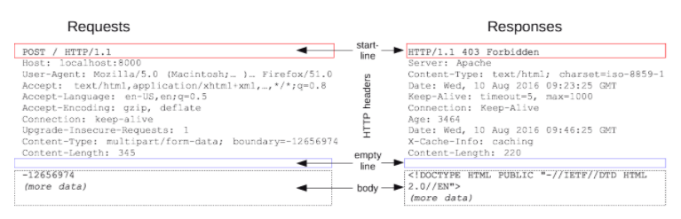

# restful api

> REST(*RE*presentational *S*tate *T*ransfer)  
> The key abstraction of information in REST is a resource.

> API
> Set of definitions and protocols for building and  
> integrating application software.

```
자원의 정보를 주고 받기 위한 API
```
ref) https://restfulapi.net/

## 6 Architectural Constraints

1. Uniform interface  
   : 시스템 내부에 있는 자원을은 유일한 의미있는 URI(uniform resource identifier)가 있으며, 정보획득, 부여 등의 기능을 수행할 수 있어야 함
2. Client-server  
   : URI가 변하지 않는 다면 client와 server는 종속성 없이 개발/발전 시킬수 있어야 한다.
3. Stateless  
   : 서버는 이전 요청 또는 마지막 요청의 어떤 정보도 유지 하지 않고 각각의 요청에 대해서만 처리한다. No session, No history
4. Cacheable  
  : 가능하다면 자원의 정보는 캐쉬처리를 해야한다.  
    ```
    Well-managed caching partially or completely eliminates some client-server interactions, further improving scalability and performance.
    ```
5. Layed system  
   : api, data, 인증 등을 서로 다른서버로 분리하여 구성 할 수 있다.
6. Code on demand(optional)  
   : 필요시 실행가능한 결과물(code, UI rendered 등)를 제공할 수 있다.

## Resource Methods
> 꼭 http GET/POST/PUT/DELETE을 써야 하는 것은 아니다.  
> 필요에 따라 정의하면 된다.  
> 그러나, 일반적으로 http methods를 많이 활용한다.

| Features           | GET Methods                       | POST/PUT/DELETE   |
| ------------------ | --------------------------------- | ----------------- |
| Cacheable          | Yes                               | No                |
| Browser History    | Yes                               | No                |
| Bookmark           | Yes                               | No                |
| Length             | Max: 2048 char                    | Free              |
| Back button/Reload | Harmless                          | Data re-submitted |
| Encoding           | application/x-www-form-urlencoded | any               |
| Data Type          | Only ASCII                        | No restrictions   |

### GET Methods
> 주로 데이터 요청에 사용됨.

http(s)://domain/[path]/[servlet]?key1=value&key2=value

``` sh
curl --location --request GET 'https://api.bithumb.com/public/candlestick/BTC_KRW/1m'
```

### POST/PUT Methods
> 데이터를 전송해서 리소스를 생성 또는 변경에 사용되며,  
> 데이터는 http request의 body에 위치한다.

* POST vs PUT  
  > 실행결과가 항상 동일한 멱등성이 있는 경우 일반적으로 **PUT**을 사용함

```
POST [servlet_path] [HTTP/1.1 or HTTP/2]
Host: [Domain]
key11=value1&key2=value2
```

```
PUT [servlet_path] [HTTP/1.1 or HTTP/2]
Host: [Domain]
key11=value1&key2=value2
```

``` sh
curl --location --request POST 'http(s)://[domain]/[servlet_path]' \
--header 'Content-Type: application/json' \
--data-raw '{
    "key1": "value",
    "key2": "value"
}'
```

## Spring Rest API

### Request Mapping
1. Base URL : Class 수준에 Annotation @ReqeustMapping으로  지정하고, class내 함수는  
   지정된 Base 경로를 기준으로 URL이 적용됨  
      
2. Methods  
   | Annotation                                                                | HTTP Method            | Remark            |
   | ------------------------------------------------------------------------- | ---------------------- | ----------------- |
   | @RequestMapping(path="path/path") <br> @RequestMapping(value="path/path") | GET/POST/PUT/DELETE .. | 모든 HTTP Methods  |
   | @GetMapping("path")<br> @GetMapping(path="path/{variable})                | GET                    |                   |
   | @PostMapping("path")<br> @PostMapping(path="path/{variable})              | POST                   |                   |
   | @PutMapping("path")<br> @PutMapping(path="path/{variable})                | PUT                    |                   |
   | @DeleteMapping("path")<br> @DeleteMapping(path="path/{variable})          | DELETE                 |                   |  

3. URL 적용하기
   1. Annotation의 속성에 **path** 또는 **value** 값에 경로를 입력
   2. url pattern
      * "/resources/ima?e.png" - match one character in a path segment
      * "/resources/*.png" - match zero or more characters in a path segment
      * "/resources/**" - match multiple path segments
      * "/projects/{project}/versions" - match a path segment and capture it as a variable
      * "/projects/{project:[a-z]+}/versions" - match and capture a variable with a regex


4. Sample  
   ``` java
   @RequestMapping(path = "tutorial") // root reqeust path, define in value="" or path=""
   public class SamRequestmappingController {

      @RequestMapping(path="reqmapping", method=RequestMethod.GET)
      public String getMapping(){
         return "get method using RequestMapping\n";
      }

      @GetMapping("/methods")
      public String getMethod() {
         return "this is \"Get\" method\n";
      }

      @PostMapping(value="/methods")
      public String postMethod() {
         return "this is \"Post\" method\n";
      }

      @PutMapping(path="/methods")
      public String putMethod() {
         return "this is \"Put\" method\n";
      }

      @DeleteMapping("/methods")
      public String deleteMethod() {
         return "this is \"Delete\" method\n";
      }

      @GetMapping(value="/reg/{major:[vV][0-9]+}-{minor:[0-9]+}")
      public String getRegularExp(@PathVariable String major, @PathVariable String minor) {
            return "version:"+major+"-"+minor+"\n";
      }
   }
   ```

### Request Input 처리
> HTTP의 request에서 동적인 값 전달 방식은 Header, Coookie, QueryString, Form, Body를 통해 전달되며, Servlet의 Session 값을 이용하여 메모리 상에 임시로 데이터를 저장하고 활용 할 수 있음.  
> Cloud Native Application에서 Session을 활용하는 경우는 여러 불 특정한 여러 instance에서 공유해야 함으로 추가적인 미들웨어(Redis, DB 등)를 활용해야 한다.

1. http header 처리  
   http header 는 Key:Value 구조로 되어 있으며, 로직 처리에 있어 http header 값을 식별하여 처리할 경우 사용하며, http의 header의 값은 key 값을 이용하여 함수의 인자로 맵핑하여 처리 가능함  
   Annotation @RequestHeader(value="key", required=true/false, defaultValue = "value") 형태로 사용함
   ``` java
   // RequestHeader
   @GetMapping("header")
   public String handleHeader(@RequestHeader("Accept") String accept,
         @RequestHeader(value = "Keep-Alive", required = false, defaultValue = "300") long keepAlive) {

      return "Header => Accept:" + accept + ",Keep-Alive:" + keepAlive + "\n";
   }

   @GetMapping("headers")
   @ResponseStatus(value = HttpStatus.OK)
   public void allHeaders(@RequestHeader Map<String, String> headers) {

      logger.info("All headers:{}", headers);
   }
   ```
2. http cookie 처리  
   http cookie는 Key:Value 구조로 되어 있으며, 로직 처리에 있어 http cookie 값을 식별하여 처리할 경우 사용하며, http의 cookie 값은 key 값을 이용하여 함수의 인자로 맵핑하여 처리 가능함  
   Annotation @CookieValue(value="key", required=true/false, defaultValue = "value") 형태로 사용함  
   ``` java
   // curl -v --cookie "USER=SK" http://localhost:8080/input/cookie
   @GetMapping("cookie")
   @ResponseStatus(HttpStatus.OK)
   public void handleCookie(@CookieValue("USER") String user) {
      logger.info("Cookie User:{}", user);
   }
   ```
3. URL path 처리, path의 일부를 입력변수로 처리 하는 방법  
   Request value에 {..}를 사용하여 요청처리 함수에서 변수로 인식하고 type을 자동변환하여 사용 할 수 있음  
   1. 단순 변수 처리 URI의 특정 영역을 변수화 : "/projects/{project}/versions"  
      ```java
      @GetMapping("/owners/{ownerId}/pets/{petId}")
      public Pet findPet(@PathVariable Long ownerId, @PathVariable Long petId) {
         // ...
      }
      ```
   2. 변수이름을 지정 또는 변수의 유형을 regualr expression을 활용하여 uri의 문자열을 축출하여 변화화
   ```java
      @GetMapping(value="/reg/{major:[vV][0-9]+}-{minor:[0-9]+}")
      public String getRegularExp(@PathVariable String major, @PathVariable String minor) {
            return "version:"+major+"-"+minor+"\n";
      }
   ```
4. URL의 QueryString의 값을 변수처리 하는 방법 : @RequestParam을 이용하여 사용  
   request : http://.../param?name=james&age=30
   ```java
   @GetMapping("param")
   public String handleQueryString(@RequestParam("name")String name, @RequestParam("age")int age){
      
      return "name :" + name + ",age:"+age +"\n";
   }
   ```

5. http body의 값을 Java 객체로 처리하는 방법(json to object)
     
   http post로 요청되며, http의 body가 자동으로 지정된 구조(type)로 변환됨
   


### Handling Response.

